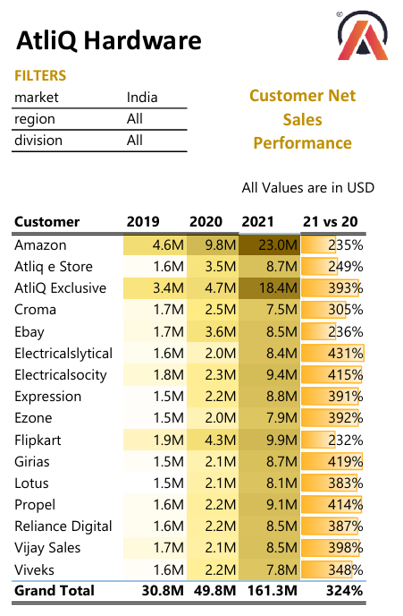
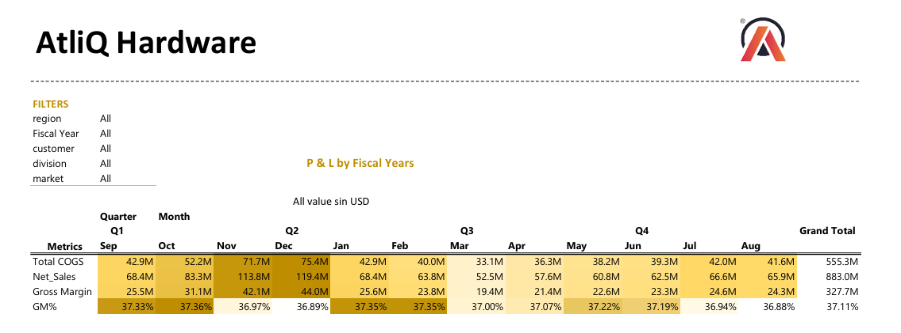

# Project : AtliQ Hardware - Sales and Finance Analytics

*✅About the Company:*

AtliQ Business Model : AtliQ hardware is a global hardware supplier of electronic hardware items such as keyboard , mouse ,printer etc.

AtliQ Hardwares --> Customers (Retailers - online and offline ) ---> Consumer

*🌱Objective:*

To Create the Sales Performance report and also Finance report for the company to provide the insights on improving the net sales and for strategic business decisions.

*💠Steps taken*
1. Understanding the Business requirement from AtlQ hardware and then understanding the fundamental business concepts related to it.
2. Extracting the data to the power query and then cleaning the data such as renaming the columns, removing the extra spaces , handling the missing values, column quality,
Handling the duplicates, etc.
3. Once done with data transformation , working on data model using the power pivot tool avalaible in the excel.
4. Building the relationships between fact and dimension tables to build a robust data model and enriched the model with DAX fromulas and functions.
5. Started building the reports and also added the custom columns and summarising the data in pivot table.
6. apply the formatting and also conditional formatting to the important KPI parametes to highlight the business key metrics.
7. Finally built the comprehensive reports as listed below
   i) Sales Performance Report
   a. Customer Net Sales Performace
   b. Market Performance vs Target
   ii) Profit and Loss statement.
   a. P&L by Fiscal Years
   b. P&L by Fiscal Year and Months.

*🟠 Technical Skills:*
1. Power Query for ETL(Extract, Transform and Load) operation.
2. Custom colums using M language .
3. Looking into the data quality by using column quality , destribuition, profile
4. Ability to derive the custome date table in Power Query.
5. Customizing the Transformation Steps to keep a track.
6. Ability to write Complex DAX calculations to enrich the model.
7. Establishing the realtionships using the Power Pivot.

*🟢Soft Skills:*
1. Understanding the Business Fundamentals such as Business model, KPI parameters etc.
2. Incorporating the user -empathic report design.
3. Applying and understanding the Functional knowledge on Finance.
4. Deviding the problem into small tasks and finally connecting all togather to achive the desired result.
5. Understanding the Domain Knowledge of sales,Finance and how exactly these KPI's will help in stategic decision making.

*⏩Information:*

1. Sales Performance report : Will help to undesrstand the Net sales across diffrent customers over the period of time.

  2. Finance Report or P&L report: It is the Fundamental insights of the company which helps to understand the important KPI parameters like Profit, Net sales,
				Cost of Goods sold (COGS), Gross margin.
    
